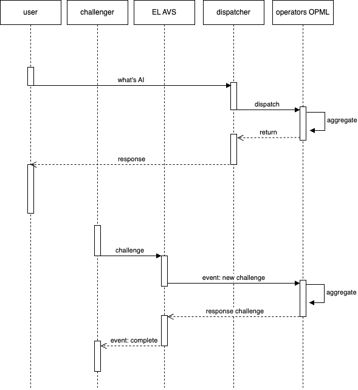
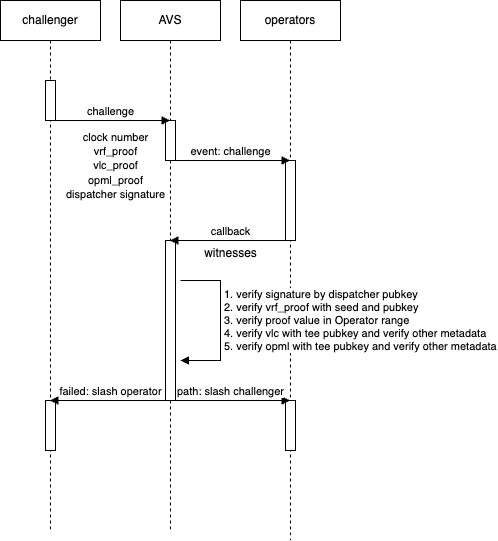

# aos-challenge-avs

# About AOS

AOS is a  AI inference verification and sampling network for Hetu protocol on Eigenlayer. AOS can bring enhanced security to AI networks, while supporting more efficient and clean verification services for AI networks.


## Architecture



# Inference


1. **The AI network sends an inference task to the dispatcher**.
2. **The dispatcher generates `vrf_val` and `vrf_proof`, and sends them to the worker**.
3. **The worker checks `vrf_val` and the range**. If `vrf_val` is within the range, the worker performs the inference and generates `opml_proof` and `vlc_proof`, then returns them to the dispatcher.
4. **The dispatcher signs the proofs and sends them to the AI network**.

# verification



1. **The Challenger interacts with the AVS service contract using (clock number, vrf_proof, vlc_proof, opml_proof) to initiate a challenge**.
2. **The AVS service contract first verifies whether the data uploaded by the Challenger has the dispatcher's signature (data integrity). If it has the signature, a challenge event is generated**.
3. **Operators monitor the challenge event and provide corresponding evidence to the AVS service contract**:
    * Verify if the VRF proof is valid;
    * Verify if the VRF seed is within the operator's range;
    * Verify if the VLC proof is correct;
    * Verify if the OPML proof is correct.
4. **The AVS service contract arbitrates the evidence and confiscates the ETH from the losing party as a penalty, awarding it to the other party**.


# Compile

## Compile

Clone this repo
```
git clone https://github.com/hetu-project/aos-challenge-avs.git
```

switch to root directory
```
cd aos-challenge-avs
```

build the contracts
```
make build-conracts
```

